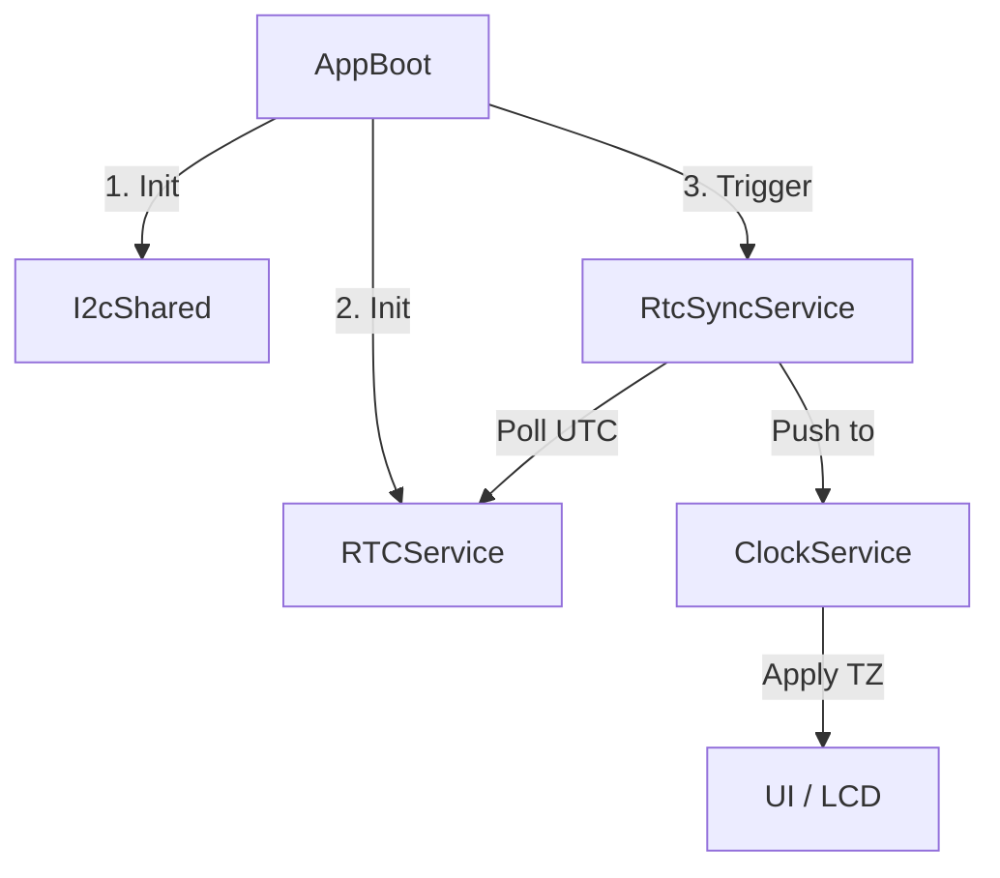

# RTC Stability Audit & Refactoring Plan (v1.50)

## 1. Wykaz obecnych błędów i zagrożeń

### [BUG-01] Naruszenie blokady I2C (Krytyczne)
*   **Lokalizacja:** `RTCService::begin()`
*   **Opis:** Funkcja wykonuje `gRtc.begin()` i `gRtc.isRunning()` bez pobrania mutexa `I2cShared::lock`. 
*   **Skutek:** Możliwa kolizja na magistrali podczas re-inicjalizacji systemu w trakcie pracy, co prowadzi do zawieszenia I2C.

### [BUG-02] Konflikt Inicjalizacji (Wysokie)
*   **Lokalizacja:** `RTCService::Config`
*   **Opis:** Flaga `initI2cMaster` w konfiguracji RTC dubluje funkcjonalność globalnego `I2cShared`. 
*   **Skutek:** Jeśli `RTCService::begin` zostanie zawołany z tą flagą, może dojść do powtórnego `Wire.begin()`, co na ESP32 resetuje stan magistrali i przerywa trwające transmisje innych zadań.

### [BUG-03] Niejasny Standard Czasu (Średnie)
*   **Opis:** System nie definiuje jednoznacznie, czy DS3231 przechowuje czas UTC czy Lokalny. `getEpoch()` sugeruje UTC, ale `getTm()` zwraca surowe dane z rejestrów.
*   **Skutek:** Problemy przy zmianie czasu (letni/zimowy) oraz przy synchronizacji NTP.

### [BUG-04] Zależności "Cyrkularne" (Niskie)
*   **Opis:** `AppBoot` -> `RtcSyncService` -> `RTCService`. Inicjalizacja dzieje się wewnątrz logiki synchronizacji, co utrudnia testowanie samej warstwy sprzętowej.

---

## 2. Plan Refaktoryzacji (Cel: Zero-Crash Architecture)

### Krok 1: Centralizacja I2C
*   Usunięcie `initI2cMaster`, `sdaPin`, `sclPin` z konfiguracji `RTCService`.
*   Sterownik RTC ma prawo korzystać WYŁĄCZNIE z już zainicjalizowanej magistrali dostarczonej przez `I2cShared`.

### Krok 2: Gwarantowane Blokowanie
*   Każda metoda w `RTCService` (włącznie z `begin`) musi być objęta `I2cShared::lock`.
*   Wprowadzenie mechanizmu "Try-Again" dla odczytów czasu, jeśli magistrala jest zajęta przez LCD.

### Krok 3: Standard UTC w Hardware
*   **Zasada:** DS3231 przechowuje ZAWSZE czas UTC.
*   **Logika:**
    1. `RtcSyncService` pobiera czas z RTC (UTC).
    2. `ClockService` nakłada na to strefę czasową (Timezone) i wyświetla czas Lokalny.
    3. Zapobiega to "skokom" czasu w logach i problemom z alarmami przy zmianie czasu.

### Krok 4: Uproszczenie API
*   Zastąpienie niestandardowej struktury `RTCService::DateTime` standardową strukturą `struct tm` z biblioteki `time.h`.

---

## 3. Nowy Schemat Blokowy

## 4. Zadania do wykonania
- [ ] Implementacja blokady w `RTCService::begin`.
- [ ] Usunięcie redundantnych parametrów I2C z `RTCService::Config`.
- [ ] Migracja `RtcSyncService` na model UTC-First.
- [ ] Dodanie weryfikacji bitu `OSF` (Oscillator Stop Flag) przy każdym odczycie, aby wykryć rozładowaną baterię RTC.
